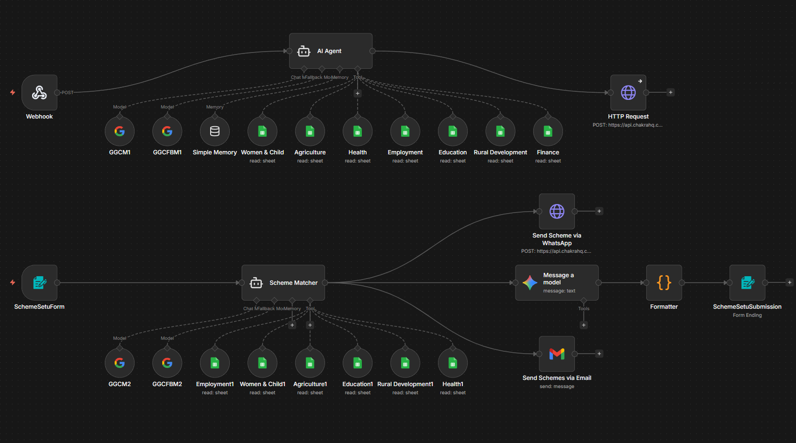
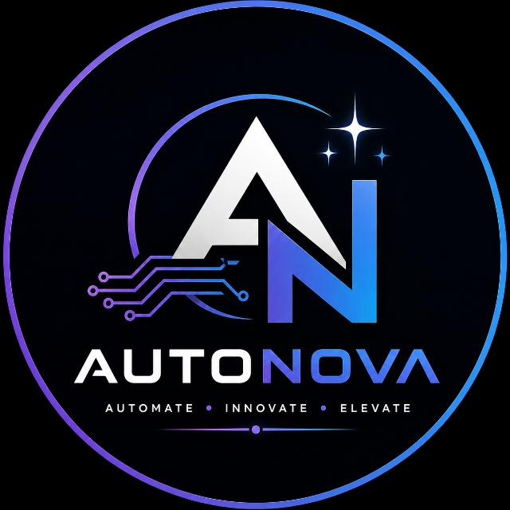

<p align="center">
  <a href="https://satvik-creations.github.io/SchemeSetu/">
    
  </a>
</p>

<p align="center">
  <a href="https://satvik-creations.github.io/SchemeSetu/">
    
  </a>
</p>

<h1 align="center">SchemeSetu</h1>

<p align="center">
  <strong>Bridging Citizens with Government Schemes</strong><br>
  An AI-assisted prototype helping citizens discover government schemes they may be eligible for.
</p>

<p align="center">
  <a href="https://satvik-creations.github.io/SchemeSetu/">Live Prototype</a> •
  <a href="https://github.com/Satvik-Creations/SchemeSetu">Source Code</a>
</p>

---

## 🇮🇳 About the Project

**SchemeSetu** is a student-built prototype developed by **Team AutoNova** as part of the **Internal Smart India Hackathon (SIH)** at **Inderprastha Engineering College, Ghaziabad**.

The project addresses a simple but important problem: **many citizens, especially those from rural and underserved areas, are unaware of government schemes and welfare programmes for which they may be eligible.**

SchemeSetu aims to make scheme discovery easier by using information provided by citizens and AI-assisted processing to identify potentially relevant schemes.

> **SchemeSetu is currently a prototype and is not an official Government of India website or service.** The name is provisional and may be changed in future development to avoid possible naming, trademark, or pre-existing registration conflicts.

## 💡 What SchemeSetu Does

- Collects relevant citizen information through a simple web interface.
- Processes the information using AI and automation.
- Matches citizen profiles with available government scheme data.
- Presents potentially relevant schemes in a citizen-friendly format.
- Uses an **n8n-based workflow** for automated processing.

## ⚙️ Technology Stack

| Component | Technology |
|---|---|
| Frontend | React, TypeScript, Vite |
| UI | Tailwind CSS, Lucide React, Motion |
| AI | Google Gemini API |
| Automation | n8n |
| Backend | Node.js, Express.js |
| Data | Structured Government Scheme Data |

## 🔄 Workflow

<p align="center">
  
</p>

**Basic flow:**

`Citizen Input → Web Application → n8n Automation → AI Processing → Scheme Matching → Citizen Response`

## 🚀 Getting Started

### Prerequisites

- Node.js
- npm
- Google Gemini API Key
- n8n (if reproducing the complete automation workflow)

### Installation

```bash
git clone https://github.com/Satvik-Creations/SchemeSetu.git
cd SchemeSetu
npm install
```

Create a `.env` file using `.env.example` and configure the required environment variables.

Run the development server:

```bash
npm run dev
```

Build the project:

```bash
npm run build
```

> **Security:** Never commit API keys, credentials, webhook secrets, or other sensitive information to the repository.

## 👨‍💻 Team AutoNova

<p align="center">
  
</p>

| Team Member | Contribution |
|---|---|
| **Shivam Kumar** | Team Leader |
| **Satvik Singhal** | Developer |
| **Saumya Sharma** | Idea Pitching |
| **Harshit Bania** | Data Categorization & SIH PowerPoint Presentation Builder |
| **Ritika** | Idea Provider — Originator of the core idea |
| **Abhishek Kumar** | Data Categorization & Excel Sheet Data Management |

All team members are students of **Inderprastha Engineering College, Ghaziabad**.

## 🏆 Internal Smart India Hackathon

SchemeSetu has been developed as part of the **Internal Smart India Hackathon (SIH)** with the objective of using technology to improve awareness and accessibility of government welfare schemes.

The current implementation is a **prototype/concept demonstration**. Future versions can incorporate verified official data sources, multilingual support, stronger eligibility validation, accessibility improvements, and direct integration with official government services.

## 🔮 Future Scope

- Multilingual and regional-language support
- Regularly updated government scheme datasets
- More accurate and explainable eligibility matching
- Direct links to official scheme application portals
- Better support for low-connectivity environments
- Integration with verified government systems

## ⚠️ Disclaimer

SchemeSetu is an **independent student-built prototype** and is **not affiliated with or officially endorsed by any government department**.

Scheme information and eligibility should always be verified through the relevant official government sources before taking any action.

---

<p align="center">
  <strong>Built by Team AutoNova to make government scheme discovery simpler for every citizen.</strong>
</p>

<p align="center">
  <a href="https://satvik-creations.github.io/SchemeSetu/">🌐 Open SchemeSetu Prototype</a>
</p>
