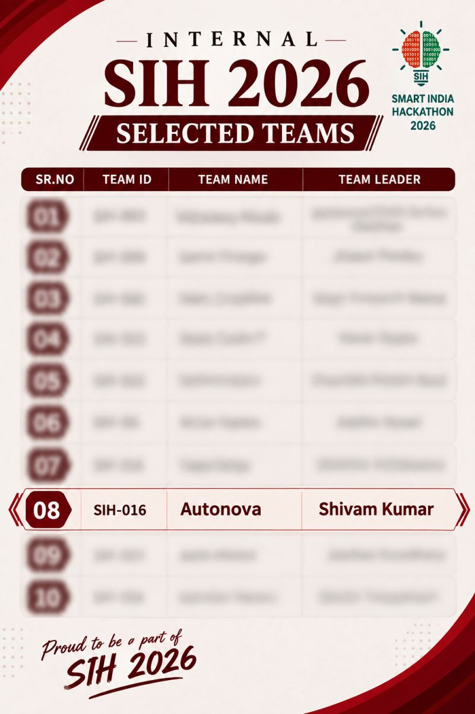

# 🏆 Achievements

## 🇮🇳 Smart India Hackathon (SIH) 2026 — Selected

We are proud to announce that **Team Autonova** has been officially selected for **Smart India Hackathon (SIH) 2026**.

### 📌 Selection Details

| Detail | Information |
|---|---|
| 🏆 Event | Smart India Hackathon 2026 |
| 👥 Team | **Autonova** |
| 🆔 Team ID | **141628** |
| 👤 Team Leader | **Shivam Kumar** |
| 🎯 Project | **SchemeSetu** |
| 🇮🇳 Status | **Selected Team** |

### 🚀 About the Achievement

Our team successfully cleared the internal selection process and earned a place among the teams selected to represent our institution at **SIH 2026**.

This achievement marks an important milestone in our journey with **SchemeSetu**, our platform designed to help citizens discover and access relevant government schemes more easily.

## 👨‍💻 Team AutoNova

  

| Team Member | Contribution |
|---|---|
| **Shivam Kumar** | Team Leader (Frontend Developer) |
| **Satvik Singhal** | Backend (Automation Developer) |
| **Saumya Sharma** | Idea Pitching |
| **Harshit Bania** | Data Categorization & SIH PowerPoint Presentation Builder |
| **Ritika** | Idea Provider — Originator of the core idea |
| **Abhishek Kumar** | Data Categorization & Excel Sheet Data Management |

All team members are students of **Inderprastha Engineering College, Ghaziabad**.

We are grateful to everyone who contributed to the development, ideation, presentation, and refinement of the project.

> **From an idea to an SIH-selected project. 🇮🇳**

---

### 📸 Selection Announcement

**Proud to be a part of SIH 2026.**